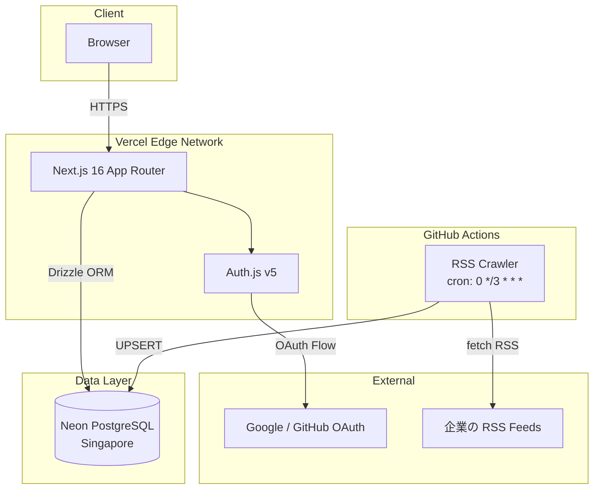

# Signalog

**気になる企業のテックブログとプレスリリースを、まとめてフォロー**

[](https://github.com/pryusei/signalog/actions/workflows/ci.yml)
[](https://signalog-ebon.vercel.app)
[](LICENSE)
[](https://www.typescriptlang.org/)

**本番環境**: https://signalog-ebon.vercel.app

---

## スクリーンショット

<!-- TODO: 実際のスクショに差し替え -->
<!-- docs/screenshots/ に以下の画像を配置してください -->
<!-- - feed.png: フィードページ (記事一覧 + フィルタ) -->
<!-- - discover.png: 企業一覧ページ -->

---

## なぜ作ったか

### Problem

エンジニアが気になる企業の技術発信を継続的に追うのは難しい。

- テックブログ・プレスリリースは企業ごとに分散しており、RSS リーダーで管理するにはフィード URL を手動で探す必要がある
- 既存の RSS リーダーは多機能すぎる / UI が古く、「企業をフォローする」というメンタルモデルに合わない
- Twitter/X は流速が速く、見落としが発生する。検索しても過去記事が埋もれる

### Solution

企業をフォローするだけで、テックブログとプレスリリースが時系列で届く。RSS フィード URL の管理はプラットフォーム側が担う。個人ユーザーは完全無料。

### マネタイズ戦略

「読者 ≒ 採用候補者」という構造を活かし、企業の採用マーケティング予算から収益化する設計（Phase 3）。

---

## 主な機能

**Phase 1 実装済み**

- Google / GitHub OAuth ログイン（Auth.js v5）
- 50 社以上の日本企業データ（初期シード済み）
- 企業フォロー / アンフォロー
- RSS クローラー（3 時間ごと自動取得、GitHub Actions で稼働）
- 時系列フィード（カーソルベース無限スクロール）
- Tech Blog / Press Release フィルタ
- 企業詳細ページ（`/companies/[slug]`）

**未実装（Phase 2 以降）**

- いいね・保存・シェア
- 週間 Top 3 記事の AI 要約（Claude Haiku）
- 週次メールダイジェスト
- 技術スタックベースのパーソナライズ

---

## 技術スタック

| Layer      | Technology                             | 採用理由                                                            |
| ---------- | -------------------------------------- | ------------------------------------------------------------------- |
| Framework  | Next.js 16 (App Router)                | Server Components による初回ロード最適化、Vercel との統合が深い     |
| Language   | TypeScript (strict mode)               | 型安全性とリファクタ耐性。`any` 禁止を徹底                          |
| Styling    | Tailwind CSS v4                        | ビルド時最適化と一貫したデザイントークン管理                        |
| Database   | Neon (Serverless PostgreSQL)           | ブランチ機能で PR ごとに DB 分離可能、Free 枠でスモールスタート可能 |
| ORM        | Drizzle ORM                            | 型安全なクエリビルダ、SQL に近い記述で可読性が高い、軽量            |
| Auth       | Auth.js v5 (NextAuth.js)               | OAuth provider の抽象化、Edge Runtime 対応                          |
| Crawler    | GitHub Actions（cron 3h）              | Phase 1 規模なら無料枠（2,000 分/月）で十分                         |
| Deploy     | Vercel                                 | Preview デプロイの即時性、Edge Network                              |
| Monitoring | Phase 2 で Sentry + Plausible 導入予定 | エラー追跡 + プライバシー配慮型アナリティクス                       |

---

## アーキテクチャ



---

## 設計上の意思決定

### アプリ層認可（PostgreSQL RLS は使わない）

NextAuth.js + Drizzle 構成では、DB 接続が単一のアプリケーションロールに集約される。`auth.uid()` を前提とする RLS は動作しないため、代替として Drizzle のクエリビルダで `where(eq(table.userId, session.user.id))` を強制する方針を採用した。

トレードオフ: 認可ロジックがアプリ層に分散するため、コードレビューでの確認が重要になる。Phase 2 でマルチテナント機能が必要になった時点で Neon の `pg_session_jwt` 拡張を用いた RLS 移行を再検討する。

### 記事本文は DB に保持しない

著作権リスクとストレージコストの両面から、記事本文は保存しない。タイトル・URL・公開日・OGP 画像 URL のみを保存し、本文は元サイトへの遷移で対応する。

トレードオフ: Phase 2 の AI 要約機能では本文が必要になる。このため、要約生成時に元記事 URL を都度 fetch する設計で対応予定（週数回程度なので負荷は許容範囲）。

### カーソルベースのページネーション

OFFSET ベースは新着記事追加時に重複・欠落が発生する。`(published_at DESC, id DESC)` の複合カーソルで回避した。

トレードオフ: 「3 ページ目に直接ジャンプ」ができないが、フィードの UX は無限スクロールが主なので問題にならない。

### URL 正規化による重複排除

RSS の `<guid>` は信頼できないフィードがあるため使用しない。URL を正規化（https 統一・末尾スラッシュ除去・フラグメント除去・トラッキングパラメータ除去）して `(company_id, normalized_url)` の UNIQUE 制約で重複を検知する。

### OGP 画像は直接参照（Vercel Image Optimization を使わない）

Vercel Image Optimization の無料枠は 1,000 枚/月。100 社 × 10 記事/週 = 1,000 枚/週で即超過するため、`` で直接参照する設計を採用した。Phase 2 で有料プランに移行するタイミングで再検討する。

### クローラーは GitHub Actions で 3 時間間隔

当初検討した 1 時間間隔は GitHub Actions Free 枠（2,000 分/月）を圧迫するリスクがあるため変更。50 社 × 約 3 分/回 × 240 回/月 = 720 分/月（Free 枠の 36%）に収める。Phase 2 で AWS Lambda + EventBridge に移行してリアルタイム化を検討する。

---

## ローカル開発のセットアップ

### 前提

- Node.js 22+
- pnpm 10+
- [Vercel CLI](https://vercel.com/docs/cli) (`npm i -g vercel`)
- Neon アカウント（Vercel Marketplace 経由での接続を推奨）

### 手順

```bash
# 1. クローン
git clone https://github.com/pryusei/signalog.git
cd signalog

# 2. 依存関係
pnpm install

# 3. 環境変数（Vercel CLI 経由で取得）
vercel link
vercel env pull .env.local

# 4. DB セットアップ
pnpm db:push    # スキーマ適用
pnpm db:seed    # 企業データ投入（55 社）

# 5. 起動
pnpm dev
# → http://localhost:3000
```

### よく使うコマンド

```bash
pnpm dev            # 開発サーバー起動
pnpm build          # プロダクションビルド
pnpm test           # ユニットテスト（Vitest）
pnpm lint           # ESLint
pnpm format         # Prettier フォーマット
pnpm db:studio      # Drizzle Studio（DB GUI）
pnpm db:seed        # シードデータ再投入
pnpm crawl          # RSS クローラー手動実行
```

---

## 開発フロー

- **main ブランチ保護**: PR 必須、CI 通過必須、Squash merge 強制
- **ブランチ命名**: `feature/SGL-<番号>-<short-description>`
- **CI**: TypeScript / ESLint / Prettier / Build（PR ごとに必須）
- **Vercel Preview**: PR ごとに自動デプロイ
- **Dependabot**: 週次で依存関係更新 PR を自動作成

---

## プロジェクト構成

```
signalog/
├── docs/                    # 設計仕様書
│   └── phase1-spec-revised.md
├── .claude/skills/          # Claude Code 用スキル定義
├── src/
│   ├── app/                 # Next.js App Router
│   │   ├── (auth)/          # ログインページ
│   │   ├── (main)/          # フィード・企業一覧・マイページ・企業詳細
│   │   └── api/             # Route Handlers
│   ├── components/          # 共通コンポーネント
│   └── lib/                 # DB クライアント・Auth 設定・ユーティリティ
├── crawler/                 # RSS クローラー（GitHub Actions で実行）
├── db/                      # Drizzle スキーマ・マイグレーション・シード
└── .github/workflows/       # CI / クローラー
```

---

## ロードマップ

**Phase 1（MVP）— 完了**
認証・企業フォロー・RSS クローラー・時系列フィード

**Phase 2（Engagement）— 計画中**
いいね・保存・AI 要約（Top 3）・週次メールダイジェスト・クローラーの AWS Lambda 移行・E2E テスト（Playwright）

**Phase 3（Monetization）— 構想**
企業向けプロモーション枠・採用広告（求人掲載）・フォロワー分析機能

---

## 既知の制約・改善余地

- Google OAuth が「テスト」ステータスのため、テストユーザー登録なしではログインできない（公開審査は Phase 2）
- Neon は Tokyo リージョン未提供のため Singapore リージョンで運用（日本からのレイテンシは 70–80ms）
- カスタムドメイン未取得（Phase 2 でユーザー数が増えてから取得予定）
- E2E テスト未整備（Phase 2 で Playwright 導入予定）
- 公開 API エンドポイントにレートリミット未実装（Phase 2 で Upstash Rate Limit 導入予定）
- CSP の `unsafe-inline` / `unsafe-eval` は Phase 2 で nonce ベースに移行予定

---

## ライセンス

[MIT License](LICENSE) © 2026 pryusei

---

## 著者

- **pryusei** — [@pryusei](https://github.com/pryusei)
- Built with [Claude Code](https://claude.com/claude-code) assistance
